# EXECUTIVE SUMMARIES

This study is part of Coursera Course on Regression Model. We will use R
package mtcars You work for Motor Trend, a magazine about the automobile
industry. Looking at a data set of a collection of cars, they are
interested in exploring the relationship between a set of variables and
miles per gallon (MPG) (outcome). They are particularly interested in
the following two questions:

“Is an automatic or manual transmission better for MPG”

“Quantify the MPG difference between automatic and manual transmissions”

Analytical Process :

1.  Data Processing & Variable Explanation
2.  Confidence level test
3.  Model Selection
4.  Summary Conclusion
5.  Appendixes (Pairs plot and Residuals Plot)

# Data Processing and Variable Explanation

### Data Processing

We load mtcars and do some data processing and explanation. ‘mtcars’
data is part of datasets library and we ll load necessary library like,
ggplot2, tidyverse,dplyr, GGally. Below variables are taken from the r
studio help, ?mtcars We ll change variable class for listed below to
factor

1.  mpg Miles/(US) gallon –\> outcome
2.  cyl Number of cylinders –\> need to be factor variable
3.  disp Displacement (cu.in.)
4.  hp Gross horsepower
5.  drat Rear axle ratio
6.  wt Weight (1000 lbs)
7.  qsec 1/4 mile time
8.  vs Engine (0 = V-shaped, 1 = straight) –\> need to be factor
    variable
9.  am Transmission (0 = automatic, 1 = manual) –\> need to be factor
    variable
10. gear Number of forward gears –\> need to be factor variable
11. carb Number of carburetors –\> need to be factor variable

``` r
library(datasets)
library(ggplot2)
library(tidyverse)
```

    ## ── Attaching core tidyverse packages ──────────────────────── tidyverse 2.0.0 ──
    ## ✔ dplyr     1.1.4     ✔ readr     2.1.5
    ## ✔ forcats   1.0.0     ✔ stringr   1.5.1
    ## ✔ lubridate 1.9.3     ✔ tibble    3.2.1
    ## ✔ purrr     1.0.2     ✔ tidyr     1.3.1
    ## ── Conflicts ────────────────────────────────────────── tidyverse_conflicts() ──
    ## ✖ dplyr::filter() masks stats::filter()
    ## ✖ dplyr::lag()    masks stats::lag()
    ## ℹ Use the conflicted package (<http://conflicted.r-lib.org/>) to force all conflicts to become errors

``` r
library(dplyr)
library(GGally)
```

    ## Registered S3 method overwritten by 'GGally':
    ##   method from   
    ##   +.gg   ggplot2

``` r
# head(mtcars)
raw_mtcars <- mtcars
raw_mtcars[,c(2,8,9,10,11)] <- lapply(raw_mtcars[,c(2,8,9,10,11)],as.factor)
levels(raw_mtcars$am) <- c("AT","MN")
```

### Variable Explanation and Corelation

GGPairs plot showing corelation plot for each variable to understand
which variable are corelated so we can remove it and we will explain it
on lm model

1.  Variable am and vs seems correlated, similar impact to mpg –\> we
    will use am

2.  Variable am and cyc seems uncorelated, it has negative impact to mpg
    –\> we will use cyc variable as confound variable

3.  Variable am and disp seems uncorelated, it has different in
    distribution

4.  Variable am and drat seems uncorelated, it has different in
    distribution

5.  Variable am and wt seems uncorelated, it has different in
    distribution

6.  Variable am and qseq seems corelated, it has similar distributions

7.  Variable am and hp seems uncorelated

We will see this distribution to get better understanding

``` r
head(raw_mtcars)
```

    ##                    mpg cyl disp  hp drat    wt  qsec vs am gear carb
    ## Mazda RX4         21.0   6  160 110 3.90 2.620 16.46  0 MN    4    4
    ## Mazda RX4 Wag     21.0   6  160 110 3.90 2.875 17.02  0 MN    4    4
    ## Datsun 710        22.8   4  108  93 3.85 2.320 18.61  1 MN    4    1
    ## Hornet 4 Drive    21.4   6  258 110 3.08 3.215 19.44  1 AT    3    1
    ## Hornet Sportabout 18.7   8  360 175 3.15 3.440 17.02  0 AT    3    2
    ## Valiant           18.1   6  225 105 2.76 3.460 20.22  1 AT    3    1

``` r
glimpse(raw_mtcars)
```

    ## Rows: 32
    ## Columns: 11
    ## $ mpg  <dbl> 21.0, 21.0, 22.8, 21.4, 18.7, 18.1, 14.3, 24.4, 22.8, 19.2, 17.8,…
    ## $ cyl  <fct> 6, 6, 4, 6, 8, 6, 8, 4, 4, 6, 6, 8, 8, 8, 8, 8, 8, 4, 4, 4, 4, 8,…
    ## $ disp <dbl> 160.0, 160.0, 108.0, 258.0, 360.0, 225.0, 360.0, 146.7, 140.8, 16…
    ## $ hp   <dbl> 110, 110, 93, 110, 175, 105, 245, 62, 95, 123, 123, 180, 180, 180…
    ## $ drat <dbl> 3.90, 3.90, 3.85, 3.08, 3.15, 2.76, 3.21, 3.69, 3.92, 3.92, 3.92,…
    ## $ wt   <dbl> 2.620, 2.875, 2.320, 3.215, 3.440, 3.460, 3.570, 3.190, 3.150, 3.…
    ## $ qsec <dbl> 16.46, 17.02, 18.61, 19.44, 17.02, 20.22, 15.84, 20.00, 22.90, 18…
    ## $ vs   <fct> 0, 0, 1, 1, 0, 1, 0, 1, 1, 1, 1, 0, 0, 0, 0, 0, 0, 1, 1, 1, 1, 0,…
    ## $ am   <fct> MN, MN, MN, AT, AT, AT, AT, AT, AT, AT, AT, AT, AT, AT, AT, AT, A…
    ## $ gear <fct> 4, 4, 4, 3, 3, 3, 3, 4, 4, 4, 4, 3, 3, 3, 3, 3, 3, 4, 4, 4, 3, 3,…
    ## $ carb <fct> 4, 4, 1, 1, 2, 1, 4, 2, 2, 4, 4, 3, 3, 3, 4, 4, 4, 1, 2, 1, 1, 2,…

``` r
ggplot(raw_mtcars,aes(x=am,y=mpg))+geom_boxplot(aes(fill = am))+theme_bw()+labs(x="Auto or Manual",y="Miles per gallon",title = "Miles per Gallons vs Auto/Manual")
```

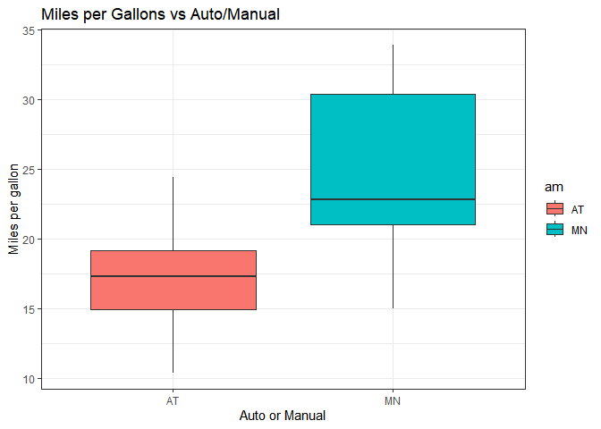

Below are Correlation Density for above variable We will see mpg
distribution per transmissions to get idea how data distributed. We can
see mpg vs AM are not perfectly separated, there will be some unknown
factor to get perfect modelling

``` r
ggplot(raw_mtcars,aes(mpg))+geom_density(aes(fill = am),alpha = 0.3, width = 0.3)+labs(x="mpg",y="Density",title = "MPG vs AM Density")
```

    ## Warning in geom_density(aes(fill = am), alpha = 0.3, width = 0.3): Ignoring
    ## unknown parameters: `width`

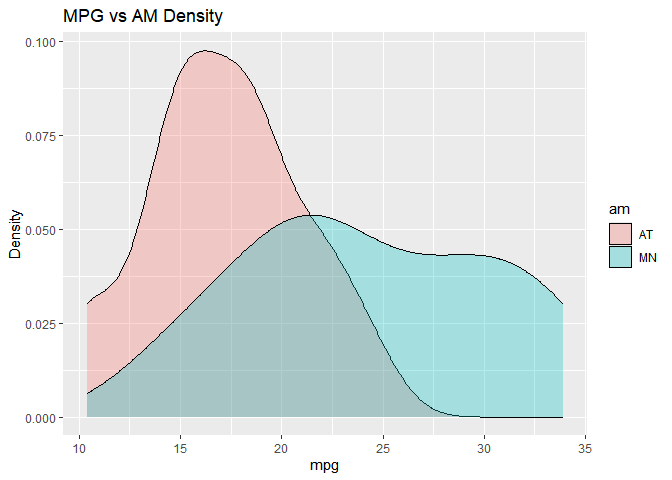
Below are variable corelation density We see here that 1. DISP and AM
are unclearly separated, this suggest that DISP is abit corelated with
AM, this suggest not to use DISP as regressor

1.  DRAT and AM are separated, this suggest that DRAT is uncorelated
    with AM, this suggest to use DRAT as regressor

2.  WT and AM are separated, this suggest that WT is uncorelated with
    AM, this suggest to use WT as regressor

3.  QSEC and AM are not separated, this suggest that QSEC is corelated
    with AM, this suggest not to use DISP as regressor

4.  HP and AM are separated, this suggest that HP is uncorelated with
    AM, this suggest to use HP as regressor

5.  We can see cyl is also uncorelated based on pairs on appendix

``` r
ggplot(raw_mtcars,aes(disp))+geom_density(aes(fill = am),alpha = 0.3)+labs(x="disp",y="Density",title = "DISP vs AM Density")
```

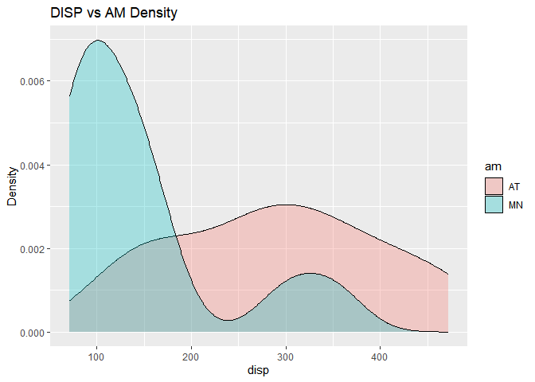

``` r
ggplot(raw_mtcars,aes(drat))+geom_density(aes(fill = am),alpha = 0.3)+labs(x="drat",y="Density",title = "DRAT vs AM Density")
```

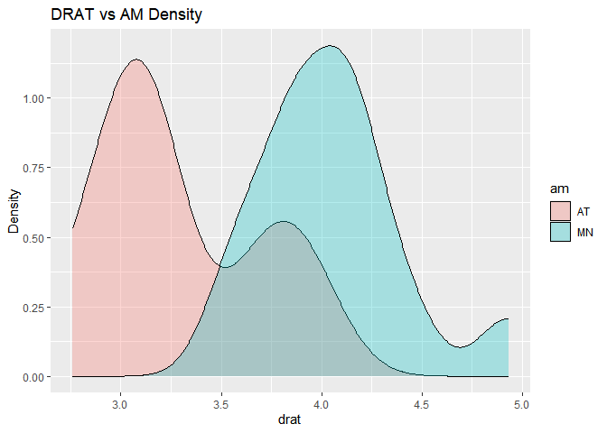

``` r
ggplot(raw_mtcars,aes(wt))+geom_density(aes(fill = am),alpha = 0.3)+labs(x="wt",y="Density",title = "WT vs AM Density")
```

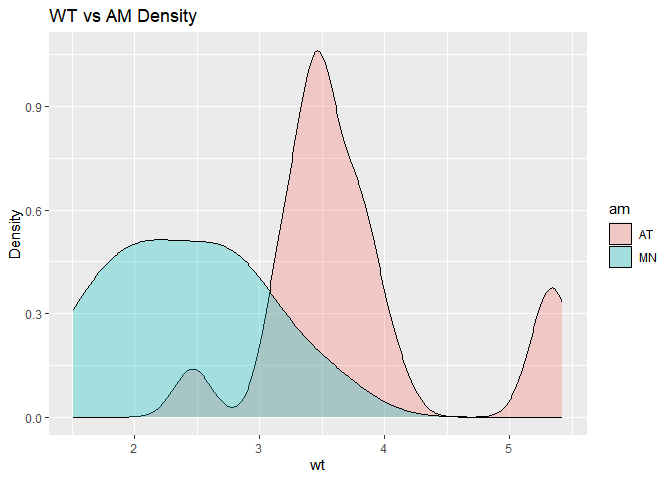

``` r
ggplot(raw_mtcars,aes(qsec))+geom_density(aes(fill = am),alpha = 0.3)+labs(x="qsec",y="Density",title = "QSEC vs AM Density")
```

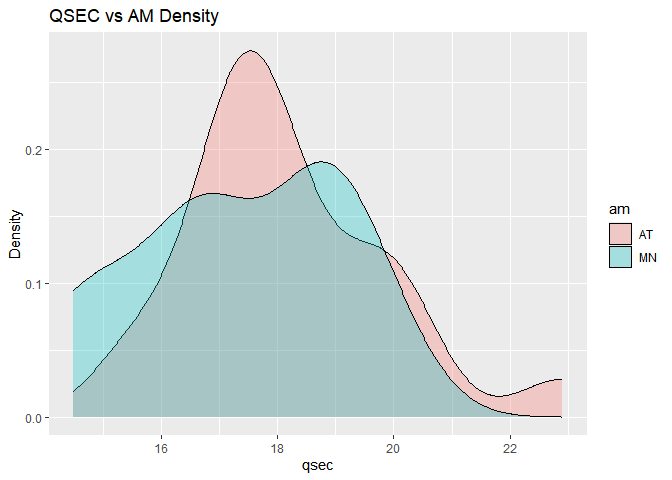

``` r
ggplot(raw_mtcars,aes(hp))+geom_density(aes(fill = am),alpha = 0.3)+labs(x="hp",y="Density",title = "HP vs AM Density")
```

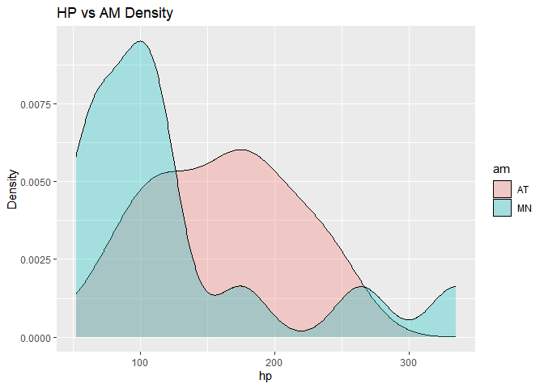

# Confidence Level

This is to calculate the statistical inference about the MPG difference
for Automatic and Manual Transmission. From previous box plot, we can
see clear MPG difference for Automatic and Manual Transmission.

``` r
t.test(filter(raw_mtcars,am == "AT")$mpg, filter(raw_mtcars,am == "MN")$mpg)
```

    ## 
    ##  Welch Two Sample t-test
    ## 
    ## data:  filter(raw_mtcars, am == "AT")$mpg and filter(raw_mtcars, am == "MN")$mpg
    ## t = -3.7671, df = 18.332, p-value = 0.001374
    ## alternative hypothesis: true difference in means is not equal to 0
    ## 95 percent confidence interval:
    ##  -11.280194  -3.209684
    ## sample estimates:
    ## mean of x mean of y 
    ##  17.14737  24.39231

We can see the t value = -3.77 and confidence interval is negative value
with no 0 crossing, it suggests that MPG value for Automatic and Manual
Transmission is different with Manual Transmission has higher Miles per
Gallon. P-Value of 0.1% is sufficient to reject Null Hipothesis and
suggested Alternative Hipothesis

# Modelling

We will use multiple modelling to see which model have better
understanding \### 1. AM only as regressor

``` r
model1 <- lm(mpg~am,raw_mtcars)
summary(model1)
```

    ## 
    ## Call:
    ## lm(formula = mpg ~ am, data = raw_mtcars)
    ## 
    ## Residuals:
    ##     Min      1Q  Median      3Q     Max 
    ## -9.3923 -3.0923 -0.2974  3.2439  9.5077 
    ## 
    ## Coefficients:
    ##             Estimate Std. Error t value Pr(>|t|)    
    ## (Intercept)   17.147      1.125  15.247 1.13e-15 ***
    ## amMN           7.245      1.764   4.106 0.000285 ***
    ## ---
    ## Signif. codes:  0 '***' 0.001 '**' 0.01 '*' 0.05 '.' 0.1 ' ' 1
    ## 
    ## Residual standard error: 4.902 on 30 degrees of freedom
    ## Multiple R-squared:  0.3598, Adjusted R-squared:  0.3385 
    ## F-statistic: 16.86 on 1 and 30 DF,  p-value: 0.000285

### 2. All Variable as regressor

``` r
model2 <- lm(mpg~cyl+disp+hp+drat+wt+qsec+vs+am+gear+carb,raw_mtcars)
summary(model2)
```

    ## 
    ## Call:
    ## lm(formula = mpg ~ cyl + disp + hp + drat + wt + qsec + vs + 
    ##     am + gear + carb, data = raw_mtcars)
    ## 
    ## Residuals:
    ##     Min      1Q  Median      3Q     Max 
    ## -3.5087 -1.3584 -0.0948  0.7745  4.6251 
    ## 
    ## Coefficients:
    ##             Estimate Std. Error t value Pr(>|t|)  
    ## (Intercept) 23.87913   20.06582   1.190   0.2525  
    ## cyl6        -2.64870    3.04089  -0.871   0.3975  
    ## cyl8        -0.33616    7.15954  -0.047   0.9632  
    ## disp         0.03555    0.03190   1.114   0.2827  
    ## hp          -0.07051    0.03943  -1.788   0.0939 .
    ## drat         1.18283    2.48348   0.476   0.6407  
    ## wt          -4.52978    2.53875  -1.784   0.0946 .
    ## qsec         0.36784    0.93540   0.393   0.6997  
    ## vs1          1.93085    2.87126   0.672   0.5115  
    ## amMN         1.21212    3.21355   0.377   0.7113  
    ## gear4        1.11435    3.79952   0.293   0.7733  
    ## gear5        2.52840    3.73636   0.677   0.5089  
    ## carb2       -0.97935    2.31797  -0.423   0.6787  
    ## carb3        2.99964    4.29355   0.699   0.4955  
    ## carb4        1.09142    4.44962   0.245   0.8096  
    ## carb6        4.47757    6.38406   0.701   0.4938  
    ## carb8        7.25041    8.36057   0.867   0.3995  
    ## ---
    ## Signif. codes:  0 '***' 0.001 '**' 0.01 '*' 0.05 '.' 0.1 ' ' 1
    ## 
    ## Residual standard error: 2.833 on 15 degrees of freedom
    ## Multiple R-squared:  0.8931, Adjusted R-squared:  0.779 
    ## F-statistic:  7.83 on 16 and 15 DF,  p-value: 0.000124

### 3. Only uncorelated variable as regressor (DRAT,HP,WT,CYL and AM)

Below Linear Model have better R-Squared error compare to previous 2
models. This model suggest below points : 1. Each unit change on Manual
Transmission Type has ~1.7mpg difference 2. Each unit change on Weight
has -2.4mpg difference 3. Each unit change on Rear Axle Ratio has
~0.27mpg difference 4. Each unit change on Horse Power has ~-0.03mpg
difference 5. Each unit change on Cylinder has ~-2.9 and -1.9 mpg
difference for Cyl 6&8 respectively

``` r
model3 <- lm(mpg~cyl+hp+drat+wt+am,raw_mtcars)
summary(model3)
```

    ## 
    ## Call:
    ## lm(formula = mpg ~ cyl + hp + drat + wt + am, data = raw_mtcars)
    ## 
    ## Residuals:
    ##     Min      1Q  Median      3Q     Max 
    ## -3.8457 -1.3028 -0.4241  1.0301  5.0425 
    ## 
    ## Coefficients:
    ##             Estimate Std. Error t value Pr(>|t|)    
    ## (Intercept) 32.64612    6.16107   5.299 1.72e-05 ***
    ## cyl6        -2.93288    1.52390  -1.925   0.0657 .  
    ## cyl8        -1.98098    2.51657  -0.787   0.4386    
    ## hp          -0.03255    0.01415  -2.301   0.0300 *  
    ## drat         0.27447    1.43667   0.191   0.8500    
    ## wt          -2.47152    0.91214  -2.710   0.0120 *  
    ## amMN         1.70439    1.52504   1.118   0.2744    
    ## ---
    ## Signif. codes:  0 '***' 0.001 '**' 0.01 '*' 0.05 '.' 0.1 ' ' 1
    ## 
    ## Residual standard error: 2.456 on 25 degrees of freedom
    ## Multiple R-squared:  0.8661, Adjusted R-squared:  0.8339 
    ## F-statistic: 26.95 on 6 and 25 DF,  p-value: 9.151e-10

# Summary and Conclusion

As per Linear Regression Modelling we can conclude below points :

1.  Transmission Type suggest to have significant impact on Miles per
    Gallons based on T - test statistic suggest that it has significant
    difference

2.  Here are factors impacting MPG based on linear model, Transmission
    Type, Weight, Rear Axle, Horse Power, Cylinder

3.  Model suggest that Manual Transmission has better MPG

4.  Some unexplainable factors due to Automatic and Manual Transmission
    MPG Density data are not perfectly segregated

# APENDIXES

Correlation Pairs Diagram

``` r
ggpairs(raw_mtcars,mapping = aes(col = am)) + theme_bw()
```

    ## `stat_bin()` using `bins = 30`. Pick better value with `binwidth`.
    ## `stat_bin()` using `bins = 30`. Pick better value with `binwidth`.
    ## `stat_bin()` using `bins = 30`. Pick better value with `binwidth`.
    ## `stat_bin()` using `bins = 30`. Pick better value with `binwidth`.
    ## `stat_bin()` using `bins = 30`. Pick better value with `binwidth`.
    ## `stat_bin()` using `bins = 30`. Pick better value with `binwidth`.
    ## `stat_bin()` using `bins = 30`. Pick better value with `binwidth`.
    ## `stat_bin()` using `bins = 30`. Pick better value with `binwidth`.
    ## `stat_bin()` using `bins = 30`. Pick better value with `binwidth`.
    ## `stat_bin()` using `bins = 30`. Pick better value with `binwidth`.
    ## `stat_bin()` using `bins = 30`. Pick better value with `binwidth`.
    ## `stat_bin()` using `bins = 30`. Pick better value with `binwidth`.
    ## `stat_bin()` using `bins = 30`. Pick better value with `binwidth`.
    ## `stat_bin()` using `bins = 30`. Pick better value with `binwidth`.
    ## `stat_bin()` using `bins = 30`. Pick better value with `binwidth`.
    ## `stat_bin()` using `bins = 30`. Pick better value with `binwidth`.
    ## `stat_bin()` using `bins = 30`. Pick better value with `binwidth`.
    ## `stat_bin()` using `bins = 30`. Pick better value with `binwidth`.
    ## `stat_bin()` using `bins = 30`. Pick better value with `binwidth`.
    ## `stat_bin()` using `bins = 30`. Pick better value with `binwidth`.
    ## `stat_bin()` using `bins = 30`. Pick better value with `binwidth`.
    ## `stat_bin()` using `bins = 30`. Pick better value with `binwidth`.
    ## `stat_bin()` using `bins = 30`. Pick better value with `binwidth`.
    ## `stat_bin()` using `bins = 30`. Pick better value with `binwidth`.
    ## `stat_bin()` using `bins = 30`. Pick better value with `binwidth`.
    ## `stat_bin()` using `bins = 30`. Pick better value with `binwidth`.
    ## `stat_bin()` using `bins = 30`. Pick better value with `binwidth`.
    ## `stat_bin()` using `bins = 30`. Pick better value with `binwidth`.
    ## `stat_bin()` using `bins = 30`. Pick better value with `binwidth`.
    ## `stat_bin()` using `bins = 30`. Pick better value with `binwidth`.

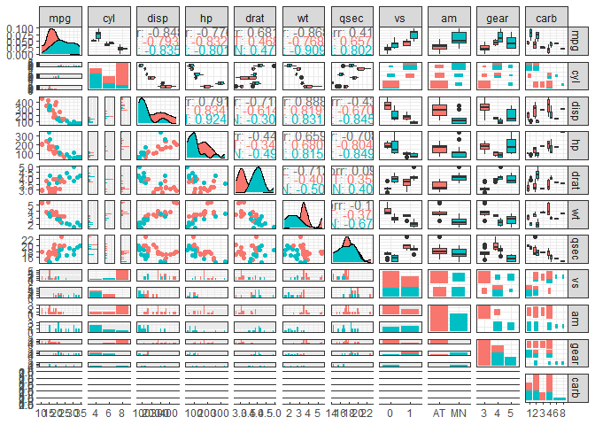

Residual diagram of model 1

``` r
plot(model1)
```

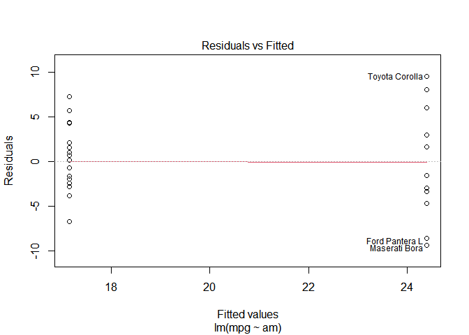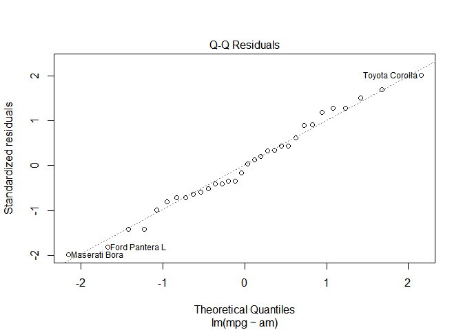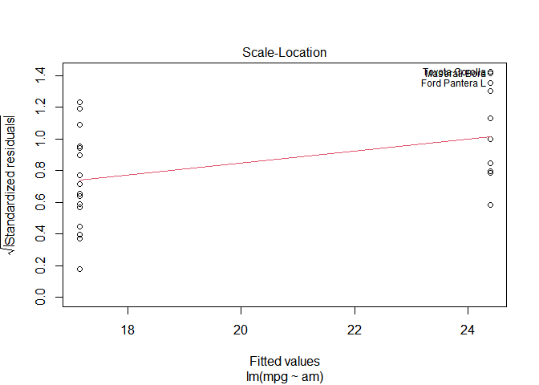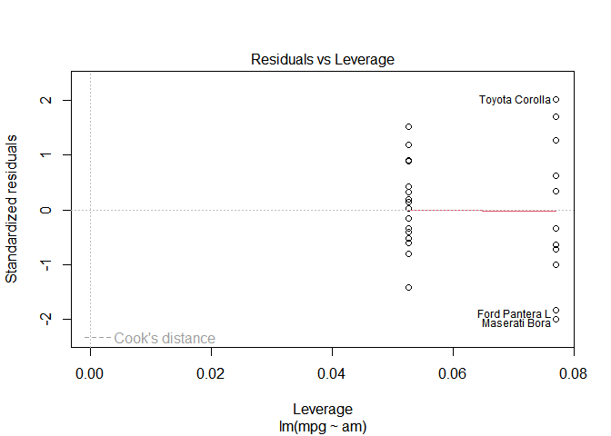
Residual plot of model 2

``` r
plot(model2)
```

    ## Warning: not plotting observations with leverage one:
    ##   30, 31

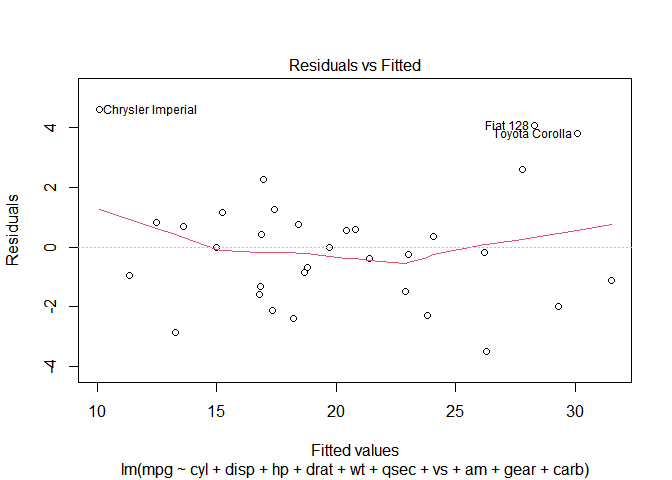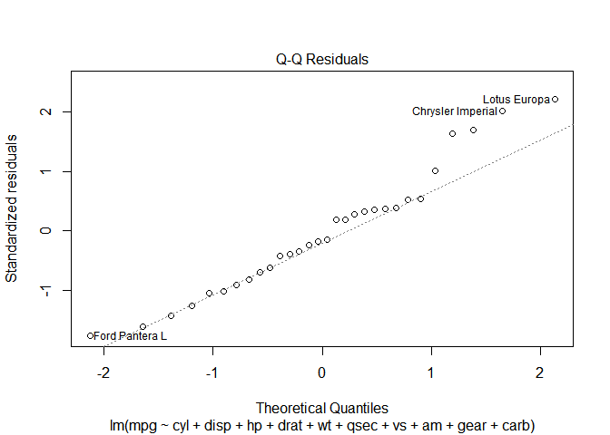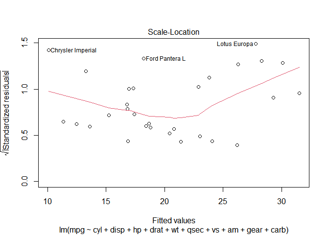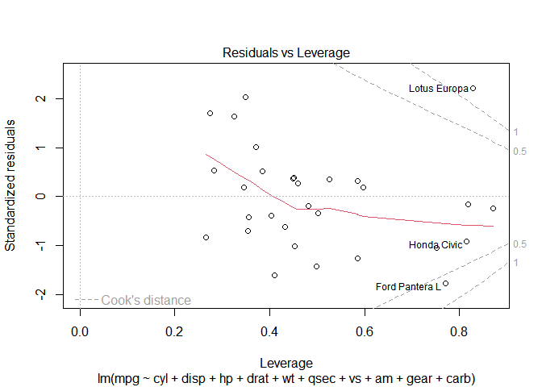

residual plot of model 3 (best model)

``` r
plot(model3)
```

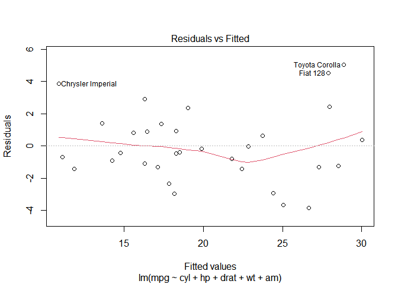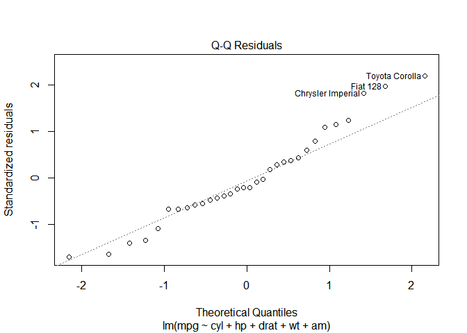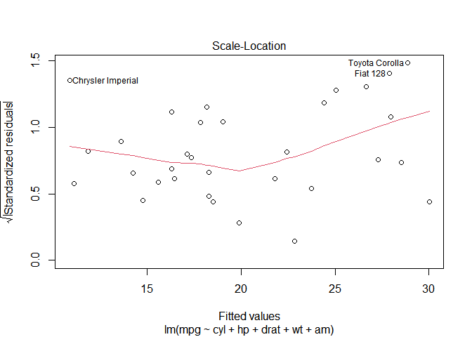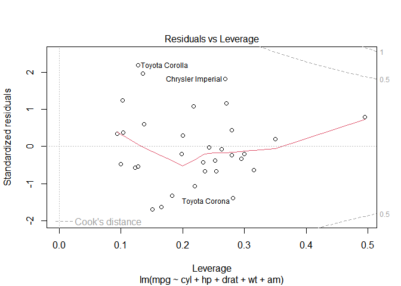
